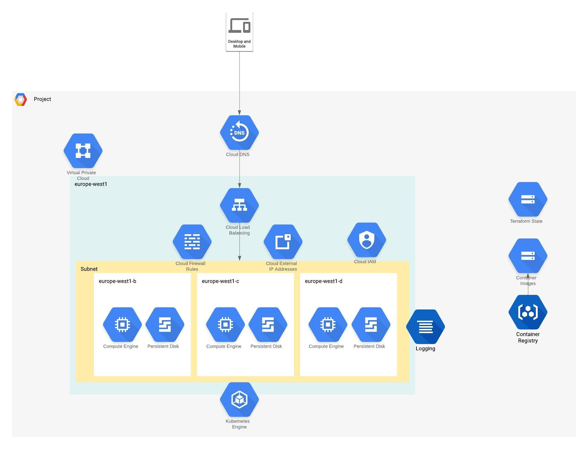

# Scaffolding Pipeline GCP

## Building Infrastructure Platform

Following resources would be created using this repo.

   1) VPC and subnet
   2) GKE regional cluster (default region: europe-west1, default name: demo-application) with a nodepool
   3) Relevant service accounts
   4) Container registry (GCR)
   5) Secret "gcr-json-key" for docker image pull access for deployments
   6) Static IP address
   7) Cloud DNS, DNS Zone with A type record set pointing to static IP
   7) nginx ingress-controller
   8) cert-manager and letsencrypt

- This repo's Dockerfile is used to create image (japrakash/cci-terraform-light-gcloudsdk:0.0.1) with terraform and gcloud sdk

## Getting Started

1) Find out a GCP project or create a new one and then create a bucket e.g. "demo-tfstate-eu-gcs" for saving terraform state.

2) Create a service account "cicd-pipeline" which will be used to run pipelines. Download its key file in json format and use as GCP_CREDS value.

3) Create below mentioned env variables in CircleCi with respective values
   
           CLUSTER_NAME = demo-application
           CLUSTER_REGION = europe-west1
           GCP_CREDS = <json file contents created in step 2>
           GCP_PROJECT = jagendra-atal-prakash-contino
           DNS_NAME = demoapplication.squadzero.io.

4) Let the pipeline run and that should create complete infra.

## TODO

1) PodSecurityPolicy (pod_security_policy_config) for cluster is currently disable. So need to enable it.

2) Automation of new project, terraform state bucket and service account creation.

3) Introduce tflint and tfsec checks in pipeline.

## Cluster Module Details

### Requirements

No requirements.

### Providers

| Name | Version |
|------|---------|
| google | n/a |
| google-beta | n/a |
| random | n/a |

### Inputs

| Name | Description | Type | Default | Required |
|------|-------------|------|---------|:--------:|
| default\_max\_nodes\_per\_zone\_per\_pool | n/a | `string` | `"3"` | no |
| default\_min\_nodes\_per\_zone\_per\_pool | n/a | `string` | `"1"` | no |
| disk\_size\_gb | n/a | `string` | `"100"` | no |
| disk\_type | n/a | `string` | `"pd-standard"` | no |
| gcr\_bucket\_name | The bucket name for the Google Container Registry | `any` | n/a | yes |
| initial\_node\_count | n/a | `string` | `"1"` | no |
| machine\_type | n/a | `any` | n/a | yes |
| min\_master\_version | n/a | `any` | n/a | yes |
| name | n/a | `any` | n/a | yes |
| node\_ip\_range | n/a | `any` | n/a | yes |
| node\_pool\_oauth\_scopes | The oauth scope(s) to apply to the node pools | `list(string)` | <pre>[   "cloud-platform" ]</pre> | no |
| nodepool\_count | n/a | `any` | n/a | yes |
| pod\_ip\_range | n/a | `any` | n/a | yes |
| preemptible | n/a | `any` | n/a | yes |
| region | n/a | `any` | n/a | yes |
| service\_ip\_range | n/a | `any` | n/a | yes |

### Outputs

| Name | Description |
|------|-------------|
| cluster\_ca\_certificate | n/a |
| cluster\_endpoint | n/a |
| cluster\_master\_version | n/a |
| cluster\_name | n/a |
| cluster\_region | n/a |
| network\_name | n/a |
| service\_account\_email | n/a |
| subnet\_name | n/a |
